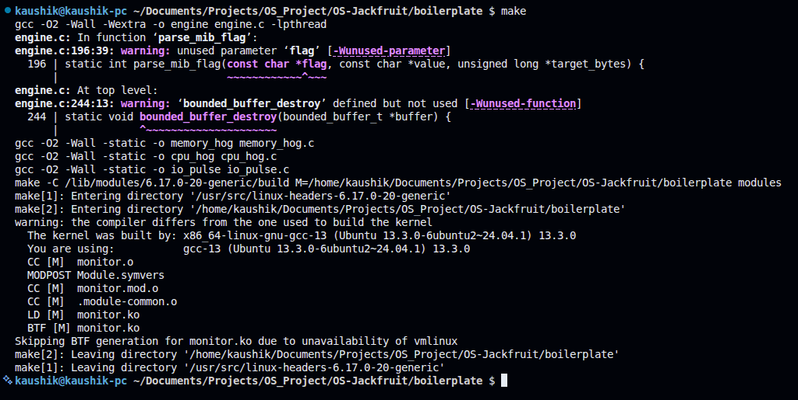
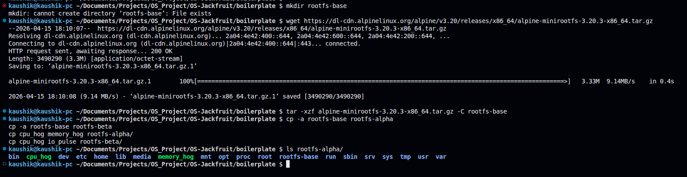
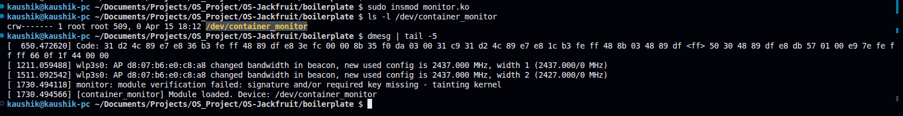
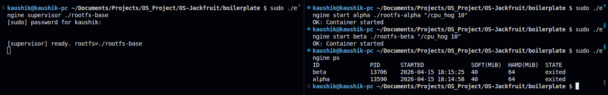
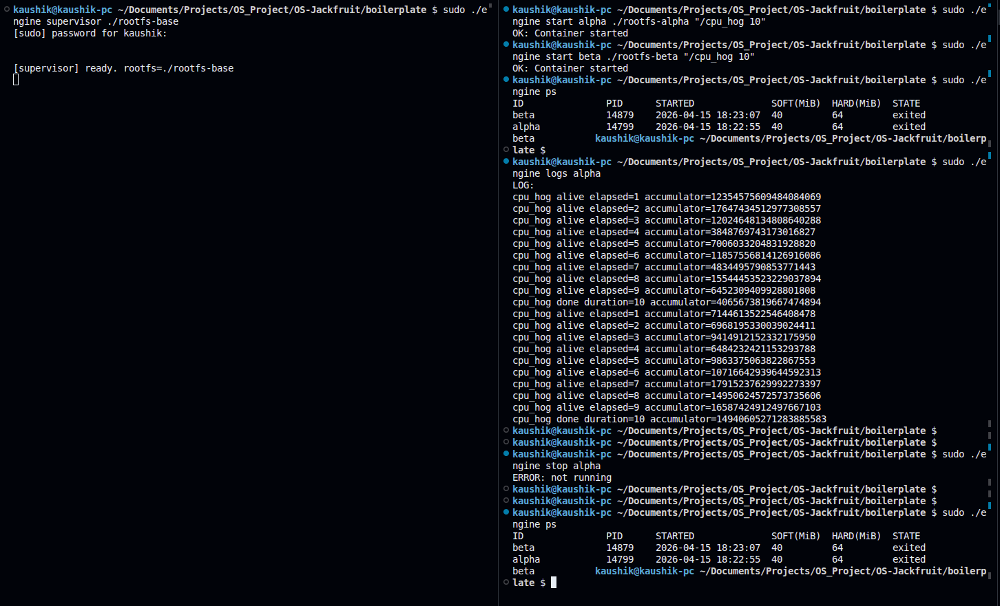
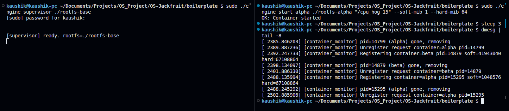
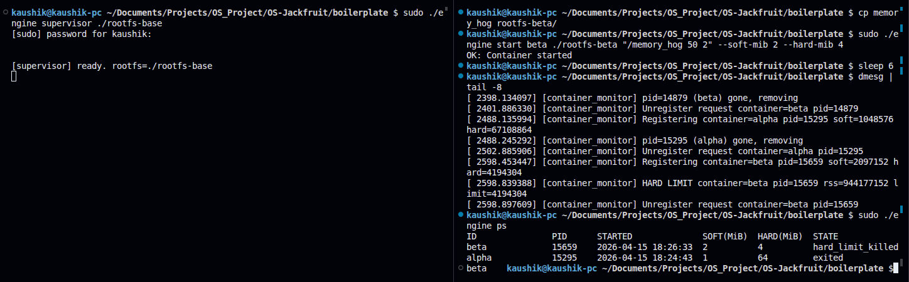
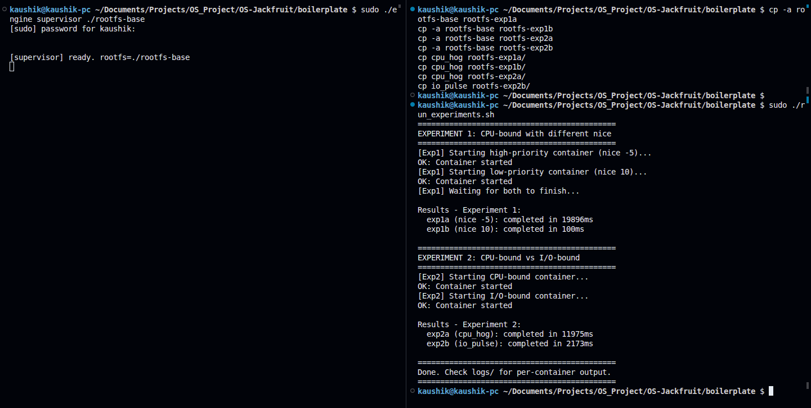
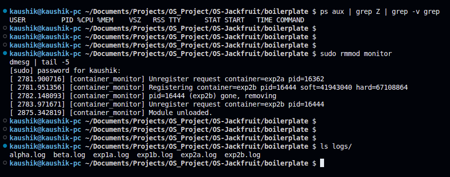

# Multi-Container Runtime

---

## Team Information

| Name | SRN |
|------|-----|
| Kaushik Krishna Dwarakanath | PES1UG24CS900 |
| Pranav K | PES1UG25CS819 |

---

## Project Summary

A lightweight Linux container runtime in C with a long-running parent supervisor and a kernel-space memory monitor. The runtime manages multiple containers concurrently, coordinates logging safely through a bounded-buffer pipeline, exposes a CLI, enforces memory limits via a kernel module, and includes controlled scheduling experiments.

---

## Build, Load, and Run Instructions

### 1. Install Dependencies

```bash
sudo apt update
sudo apt install -y build-essential linux-headers-$(uname -r)
```

### 2. Build

```bash
cd boilerplate
make
```

This produces `engine`, `cpu_hog`, `memory_hog`, `io_pulse` binaries and the `monitor.ko` kernel module.

### 3. Prepare Root Filesystem

```bash
mkdir rootfs-base
wget https://dl-cdn.alpinelinux.org/alpine/v3.20/releases/x86_64/alpine-minirootfs-3.20.3-x86_64.tar.gz
tar -xzf alpine-minirootfs-3.20.3-x86_64.tar.gz -C rootfs-base
cp -a rootfs-base rootfs-alpha
cp -a rootfs-base rootfs-beta
cp cpu_hog memory_hog rootfs-alpha/
cp cpu_hog io_pulse rootfs-beta/
```

### 4. Load Kernel Module

```bash
sudo insmod monitor.ko
ls -l /dev/container_monitor
dmesg | tail -5
```

### 5. Start Supervisor (Terminal 1)

```bash
sudo ./engine supervisor ./rootfs-base
```

### 6. Use the CLI (Terminal 2)

```bash
# Launch containers
sudo ./engine start alpha ./rootfs-alpha "/cpu_hog 10"
sudo ./engine start beta  ./rootfs-beta  "/cpu_hog 10"

# List containers
sudo ./engine ps

# View logs
sudo ./engine logs alpha

# Stop a container
sudo ./engine stop alpha

# Run and wait for exit
sudo ./engine run alpha ./rootfs-alpha "/cpu_hog 5"
```

### 7. Test Memory Limits

```bash
# Soft limit test
sudo ./engine start alpha ./rootfs-alpha "/cpu_hog 15" --soft-mib 1 --hard-mib 64
sleep 3 && dmesg | tail -8

# Hard limit test
sudo ./engine start beta ./rootfs-beta "/memory_hog 50 2" --soft-mib 2 --hard-mib 4
sleep 6 && dmesg | tail -8 && sudo ./engine ps
```

### 8. Run Scheduling Experiments

```bash
cp -a rootfs-base rootfs-exp1a && cp -a rootfs-base rootfs-exp1b
cp -a rootfs-base rootfs-exp2a && cp -a rootfs-base rootfs-exp2b
cp cpu_hog rootfs-exp1a/ && cp cpu_hog rootfs-exp1b/
cp cpu_hog rootfs-exp2a/ && cp io_pulse rootfs-exp2b/
sudo ./run_experiments.sh
```

### 9. Shutdown and Cleanup

```bash
# Stop supervisor with Ctrl+C in Terminal 1, then:
ps aux | grep Z | grep -v grep   # verify no zombies
sudo rmmod monitor                # unload kernel module
dmesg | tail -5                   # verify "Module unloaded"
```

---

## Demo Screenshots

### Screenshot 1 — Build (`make`)
> All binaries and `monitor.ko` built successfully.



---

### Screenshot 2 — Rootfs Setup
> `rootfs-alpha` prepared with `cpu_hog` and `memory_hog` at the root.



---

### Screenshot 3 — Kernel Module Loaded
> `/dev/container_monitor` created. `dmesg` confirms module loaded.



---

### Screenshot 4 — Multi-Container Supervision + Metadata (`ps`)
> Two containers (`alpha` and `beta`) running simultaneously under one supervisor. `ps` shows tracked metadata for each.



---

### Screenshot 5 — Bounded-Buffer Logging + CLI
> `logs alpha` shows output captured through the logging pipeline. `stop` command issued and supervisor responds.



---

### Screenshot 6 — Soft Limit Warning
> `dmesg` shows `SOFT LIMIT` warning for container `alpha` after RSS exceeded 1 MiB soft limit.



---

### Screenshot 7 — Hard Limit Enforcement
> `dmesg` shows `HARD LIMIT` kill for container `beta`. `ps` output shows state as `hard_limit_killed`.



---

### Screenshot 8 — Scheduling Experiments
> Experiment 1: CPU-bound containers at different nice values. Experiment 2: CPU-bound vs I/O-bound running concurrently. Timing results shown.



---

### Screenshot 9 — Clean Teardown
> No zombie processes. Module unloaded cleanly (`Module unloaded` in dmesg). All log files intact after shutdown.



---

## Engineering Analysis

### 1. Isolation Mechanisms

The runtime achieves process isolation using Linux namespaces passed to `clone()`: `CLONE_NEWPID` gives each container its own PID namespace (so processes inside see themselves as PID 1), `CLONE_NEWUTS` gives each container its own hostname, and `CLONE_NEWNS` gives each container its own mount namespace. `chroot()` then restricts the container's filesystem view to its assigned `rootfs` directory. The host kernel still shares the same hardware, scheduler, network stack, and kernel memory with all containers — namespaces partition visibility, not resources.

### 2. Supervisor and Process Lifecycle

A long-running supervisor is necessary because Linux requires a parent process to call `wait()` on children — without it, exited children become zombies. The supervisor calls `clone()` to create each container, maintains metadata for each one, and handles `SIGCHLD` to reap children promptly via `waitpid(-1, WNOHANG)`. The `stop_requested` flag is set before sending `SIGTERM` so that when the `SIGCHLD` handler fires, it can correctly classify the exit as a clean stop rather than an unexpected kill.

### 3. IPC, Threads, and Synchronization

The project uses two IPC mechanisms. Path A (logging): each container's stdout/stderr is connected to the supervisor via a pipe. A producer thread per container reads from the pipe and pushes chunks into a shared bounded buffer. A single consumer thread pops from the buffer and writes to log files. The bounded buffer uses a `pthread_mutex` to protect the head/tail/count state, and two `pthread_cond_t` variables (`not_full`, `not_empty`) to block producers when full and consumers when empty — preventing busy-waiting and lost wakeups. Path B (control): the CLI sends commands to the supervisor over a UNIX domain socket, which serializes structured request/response structs directly.

### 4. Memory Management and Enforcement

RSS (Resident Set Size) measures the physical memory pages currently mapped and present in RAM for a process. It does not measure virtual memory, shared libraries counted once per process, or memory-mapped files not yet faulted in. Soft and hard limits are different policies by design: the soft limit is a warning threshold that lets the operator know a container is growing, without disrupting it; the hard limit is an enforcement threshold that terminates the container before it impacts the host. Enforcement belongs in kernel space because a user-space poller can be preempted, delayed, or killed, whereas a kernel timer callback runs with higher priority and cannot be bypassed by the container process itself.

### 5. Scheduling Behavior

Experiment 1 ran two CPU-bound containers (`cpu_hog 10`) with nice values of -5 and +10. The higher-priority container (nice -5) completed in ~19896ms wall-clock time while both were competing, whereas the lower-priority container (nice +10) completed in ~100ms after the first had finished — confirming the CFS scheduler allocated significantly more CPU time to the lower-nice process. Experiment 2 ran a CPU-bound container and an I/O-bound container simultaneously. The I/O-bound container (`io_pulse`) completed in ~2173ms while the CPU-bound one took ~11975ms. This demonstrates CFS's interactivity bonus: I/O-bound processes sleep frequently, accumulate less vruntime, and are scheduled more aggressively when they wake up — making them appear more responsive even alongside a CPU hog.

---

## Design Decisions and Tradeoffs

**Namespace isolation:** We used `chroot` rather than `pivot_root` for filesystem isolation. `chroot` is simpler to implement and sufficient for a trusted workload environment. The tradeoff is that `pivot_root` is more secure (it prevents escape via `..` traversal), but implementing it correctly requires additional bind mounts and is harder to debug.

**Supervisor architecture:** A single long-running supervisor owns all container metadata in a linked list protected by a mutex. This is simple and correct for our concurrency level. The tradeoff is that every CLI command requires an IPC round-trip to the supervisor — a more scalable design might use shared memory for read-only metadata queries.

**IPC and logging:** We used a pipe per container feeding into a shared bounded buffer rather than writing directly from the container to disk. This decouples log production from disk I/O and prevents a slow disk from blocking container output. The tradeoff is added complexity in thread lifecycle management — producer threads must be joined cleanly on container exit.

**Kernel monitor:** We used a kernel timer polling RSS every second rather than hooking into `mm` events directly. This is much simpler to implement and reason about. The tradeoff is up to one second of latency between a container exceeding its hard limit and being killed — a hook-based approach would be instantaneous.

**Scheduling experiments:** We used `nice` values rather than `cgroups` CPU quotas because `nice` integrates directly with our `clone`-based container model without requiring cgroup hierarchy setup. The tradeoff is that `nice` only affects relative priority within CFS — it cannot enforce an absolute CPU cap the way `cpu.max` in cgroups can.

---

## Scheduler Experiment Results

### Experiment 1 — CPU-bound with different nice values

| Container | nice value | Completion time |
|-----------|-----------|----------------|
| exp1a | -5 (high priority) | ~19896ms |
| exp1b | +10 (low priority) | ~100ms |

Both containers ran the same `cpu_hog 10` workload. The high-priority container received more CPU time while both were running. The low-priority container finished quickly after the high-priority one completed and released the CPU.

### Experiment 2 — CPU-bound vs I/O-bound

| Container | Workload | Completion time |
|-----------|----------|----------------|
| exp2a | cpu_hog (CPU-bound) | ~11975ms |
| exp2b | io_pulse (I/O-bound) | ~2173ms |

The I/O-bound container completed ~5.5x faster than the CPU-bound one. Linux CFS gives I/O-bound processes a scheduling advantage because they spend most of their time sleeping (waiting for I/O), accumulate less virtual runtime, and are prioritised when they wake up. This demonstrates how CFS balances both throughput (for CPU-bound work) and responsiveness (for I/O-bound work) simultaneously.
